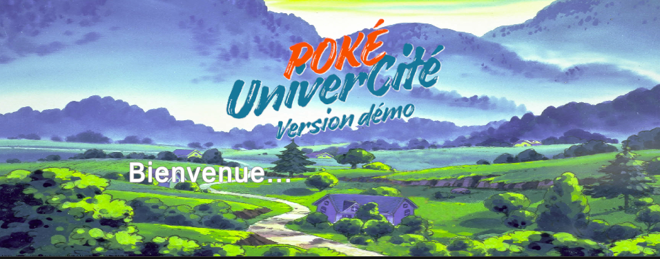
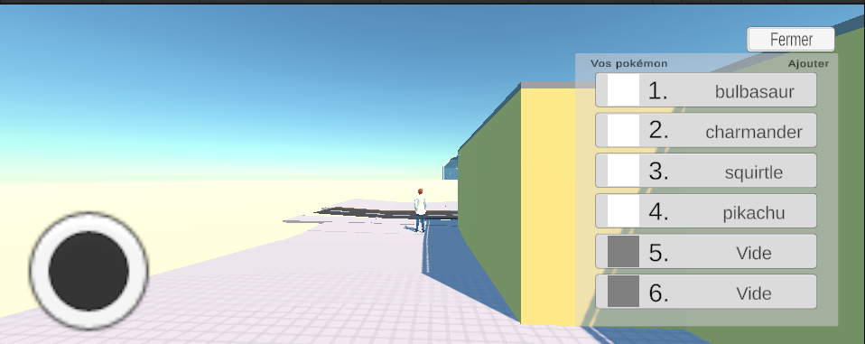
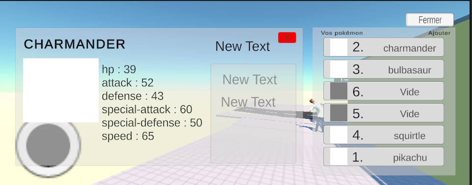

# INFO701_Unity

- Mathieu LIN M1-Informatique de l'Université Savoie Mont-Blanc
- Présentation le 17 novembre 2025
- Professeur : Thibault CARRON

## Description
Ce projet Unity est conçu pour faire un petit jeu comme Pokemon par exemple. 
Il utilise l'importation des données via PokéAPI (https://pokeapi.co/)
Notre objectif est d'imaginer comment gérer UI/UX en respectant les contraintes comme 3D, application mobile et importation des données serveur.
Il n'est pas terminé et il est pour but éducatif.

## Installation

### 1. Cloner le dépôt :
   ```bash
   git clone https://github.com/ton-compte/INFO701_Unity.git
   ```

### 2. Installer Unity 

- Télécharger Unity Hub
- Va sur le site officiel : https://unity.com/download.
- Installe Unity Hub, le gestionnaire qui permet d’ajouter et organiser plusieurs versions de Unity.
- Installer une version de Unity
- Ouvre Unity Hub.
- Clique sur Installs > Add.
- Choisis la version recommandée (souvent la LTS – Long Term Support ou 6000.2.6f2 que j'utilise actuellement).

### 3. Utiliser le projet

- Clique sur Project > Add > add project from disk ou add from repository
- Clique le dossier INFO701_Unity
- Ouvrir un projet et Unity fera générer les fichiers volumineuses
- Ajoute du Asset > Scenes > Game dans hierarchy

Si package non utilisé : 
- Clique sur Assets  Import package > Custome Package...
- Clique Pack.unitypackage

### 4. Tester sur le mobile

- Installer Unity Remote
- Dans paramètre, en mode développeur.

## Application



Sous Unity, en branchant votre mobile Android, après avoir cliqué "play" :


Le voici la page d'accueil où on peut afficher après avoir téléchargé les données via PokéAPI. (non terminé)



Après avoir cliqué la page d'accueil, vous voilà dans le jeu.



Vous pouvez vous amuser en cliquant des descriptions des pokémons. (non terminé)

## Organisation des fichiers

Certains fichiers que je n'utilise pas servent à sauvegarder la progression.

## Conclusion

Le projet me permet de comprendre le défi sur UI/UX sur l'interface 3D ainsi que l'importation des données du serveur externe. Il me permet ainsi à apprendre les outils d'Unity ainsi que le langage C#. 